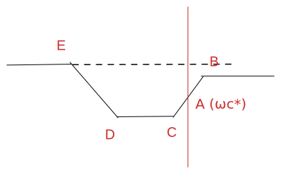

# 第六章 线性系统的校正方法

[toc]

## 1 基本矫正类型

- 串联校正
    - 根轨迹矫正
    - 频率特性矫正
- 反馈矫正：被包围环节作为一个子系统，通过反馈矫正可以改善此子系统性能，从而使整体系统性能提高
  深度负反馈可以"屏蔽"被包围环节
  
- 前馈矫正/顺馈矫正 （课本上前馈似乎指加入前馈滤波）

    使用梅森增益公式求出对应的传递函数，令传递函数为 0, 那么不管"输入"是什么，输出都没有了.

    - 按照输入补偿，令 $\frac CR=0$
    - 按照干扰补偿，令 $\frac CN=0$
- 复合矫正：多种矫正方式有机结合，一般见到的是前馈+串联

> 前馈/复合控制可以**有效地减小稳态误差**，可以这样直观理解：
> 控制是基于误差的控制，如果没有积分环节在稳态保持输出，就只能依靠误差信号产生输出.
> 前馈增加了一个输入的作用点，可以通过这个作用点使输入直接支撑输出
> 更进一步，复合矫正可以使任意输入下都无差：输入 R/N 作用点变为 2 处，通过调整一处的传函，让两处作用在某一个求和点处抵消.

## 2 根轨迹矫正

!!! warning
    这个课本上没找着，当初老师讲的也挺粗略... 我根据卢京潮的课 （十六节课下 28:30 左右）以及后续根据 DRCAN 的课程整理了一下大致思路. 实在有需要再研究.

    一般来说，根轨迹可以矫正的，频率法都能更便捷地矫正

形式为 $\frac{s-z}{s-p}$ 的补偿器/矫正网络，基本原理是通过移动零极点位置，改变相角/增益，从而实现矫正目的.

类型 | 零极点位置 | 作用
---|-------|---
超前补偿器、超前校正网络 | 零点比极点靠近虚轴 | 主要用零点提供的正相角改变相角，改变根轨迹位置，提升动态性能.
滞后补偿器、滞后矫正网络 | 极点比零点靠近虚轴，且零极点要靠近虚轴 | 主要用于改变增益 $\frac{z}{p}>1$, 提升稳态性能. 尽量不改变动态性能

> 个人总结不一定准确

### 2.1 超前补偿器

#### 2.1.1 基本概念

下面提到的是**超前校正**的思路。
视频 [超前补偿器_Lead Compensator 哔哩哔哩](https://www.bilibili.com/video/BV1JJ411i7ph/) 中称这种为超前补偿器.
简而言之，一般我们希望极点往左往下，那么设计思路为，通过添加零点使根轨迹往左弯，但是单纯增加一个零点 (PD 控制）不容易实现，且高频抗干扰能力差，所以同时添加一个距离虚轴较远的极点.

从上图看，额外加入的零极点整体提供了正相角，根据相角原理（或者结论）, 闭环极点可以往左移动.
从下面的波特图上看，其实发挥了**频域矫正**里面**超前矫正**一样的作用.

#### 2.1.2 设计方法论

1. 根轨迹矫正给的是时域指标：$\sigma,t_s\to\xi,\omega_n\to\lambda_{1,2}$

    根据主导极点理论，把系统近似看成二阶系统，则极点位于 $\lambda_{1,2}$ 时刚好满足要求.

2. 根轨迹穿过 $\lambda_{1,2}$, 说明当前系统结构下，存在合适的开环增益使极点位置满足要求，就不需要矫正了.

    根轨迹不穿过  $\lambda_{1,2}$, 就思考一下应该怎么才能让根轨迹穿过它... 比如说  $\lambda$ 代到相角条件中，发现提供的相角比 -180 还低了一些，那就说明要添加个零点再补一点到 -180

    或者通过添加开环零极点对于根轨迹的影响，添加零点根轨迹往左偏，添加极点根轨迹往右偏.

    **实际上这步做题时不需要分析，因为既然需要矫正肯定是需要矫正的.**

3. 确定矫正装置 $G_c=\frac{s-z}{s-p}$

    为了物理可实现，不可能添加纯零点... 另外，既然主要希望零点发挥作用，说明 z 离虚轴近，p 离虚轴远. 另外，这里的 z, p 都设计成**实根**!

    先确定零点 z, 一般放在期望极点的正下方（实际上可以随意放置）

    期望极点处列一下添加校正装置后的，相角条件，可以求出 p

    （任取一个 z, 那么 p 也就由相角条件确定了.)

4. 校正后根轨迹穿过 $\lambda_{1}$, 根据模值条件求出对应的 K

    这时候校正装置其实就是 z,p 以及对应的 K

5. 求出闭环传递函数
    - 闭环传递函数的极点：根轨迹 （由于位于理想极点处，可以使用根之和，根之积求出剩下的根的位置）
    - 闭环传递函数的零点：前向零点和反馈回路的极点
    - K : 详见根轨迹部分的说明，一般 分母阶数高于分子阶数，K 是开环传函的根轨迹增益，也就是前面求的 K

6. 验算与调整
    - 验算问题：看矫正后闭环极点的位置，评估能否看成二阶系统（附加零点离主导极点太近的话就不行）, 否则得用零点极点法估算性
    - 如果有不足，再调整下，比如说可以**不动控制器**，光把 K 减小点试试. 因为根不一定刚好在 $\lambda_{1,2}$处，在它附近慢慢试.
    （这个是卢京潮老师课程中提到的，意思就是矫正没有那么死板，不满足条件的话，不一定要重新设计，前面根据理论方法调整后，再看实际情况做出相应微调）
    - 不过当初自控老师讲的 PPT 里，直接忽略了附加零极点对性能的影响，原因是 "前面取ζ 时已留有余地，估计会满足要求".
    - 还有一种思路：**前置滤波组合矫正**
        根轨迹矫正理论上是可以让极点位置刚好就位于你期望他位于的地方，另外虽然有的是高阶系统，但是你选择的理想极点一般能够成为主导极点，其他极点离虚轴很远.

        但是闭环会添加一个零点（开环多一个零点，闭环也会多一个）, 并且放在理想极点正下方的话，离得还挺近的.

        比如说 $\Phi=\frac{K(s+2)}{(s+1-j)(s+1+j)}$, 添加前置滤波矫正 $F(s)=\frac 2{s+2}$, 闭环传递函数就变成了$\Phi=\frac{2K}{(s+1-j)(s+1+j)}$ （增益没有变，只是抵消了零点作用）

        同样的，如果有多余的极点 $\Phi=\frac{K(s+2)}{(s+1-j)(s+1+j)(s+5)}$ , 添加前置滤波矫正 $F(s)=\frac 25\frac {s+5}{s+2}$

#### 2.1.3 题目举例

??? example "一道根轨迹矫正题目"
    
    
    

### 2.2 滞后补偿器

> 这部分之前考研的时候没掌握，所以现在笔记总结得不多

从波特图看，实际上对应频域法矫正中的滞后校正.

需要注意的是，滞后矫正的零极点应该靠近虚轴.
这样对根轨迹施加的相角可以忽略不计 --> 不改变根轨迹 --> 保持原有的瞬态响应.

1. 绘制未校正系统的根轨迹
2. 根据瞬态性能设计要求，确定预期主导极点位置
3. 确定在预期主导极点处，未校正系统对应的误差系数
4. 根据稳态误差设计要求，确定误差系数应提升的倍数 a, 即为零极点之比
5. 按照网络零极点应靠近原点，与主导极点有足够距离，形成偶极子效应等原则，利用 a 来确定网络参数

## 3 频率特性矫正

1. 分析法： $L_0+L_c=L$ 根据$L_0$的问题，选择合适的控制器，调整参数，最终获得符合期望要求的 $L$

    | 矫正类型 | PID 类型 |
    | --- | --- |
    | 超前校正 | PD |
    | 滞后校正 | PI |
    | 滞后超前 | PID |

2. 综合法： $L-L_0=L_c$ 结合 $L_0$, 直接设计一个符合期望要求的 $L$, 幅频曲线相减就是控制器（传递函数相除） （控制器结构不可预期，往往需要简化相减后的$L_c$)

### 3.1 频域串联校正

!!! warning "明确适用条件"
    串联矫正主要是依托于幅频特性曲线的三频段理论，因此只适用于**单位负反馈的最小相位系统**

    1. 对于非单位负反馈 ⇒ 等效为单位负反馈再矫正

        

    2. 对于非最小相位系统 ⇒ 只能同时画出 $L(\omega), \varphi(\omega)$, 试探着去矫正

矫正符号规范： $\gamma, \gamma_0,\gamma^*$ （卢京潮的符号表述）

下面是我自己总结的**串联矫正方法论**, 可以不局限于此.

#### 3.1.1 确定指标

确定指标：实际工程应用中，我们第一确定的应该是闭环指标或者时域指标，需要转化成频域指标，从而依靠频域法进行矫正。

| 闭环指标 | 开环指标 | 时域指标 | 大概含义 |
| --- | --- | --- | --- |
| $M_r=\frac1{\sin\gamma}$ | $\gamma$ | $\xi$ | 相对稳定性 |
| $\omega_r,\omega_b$ | $\omega_c$ | $t_s(\omega_n)$ | 快速性 |

> 区分各个指标对应的是什么情况，互相之间又是相通的。阻尼增大，闭环带宽就减小，系统响应速度减慢。
基本上各种$\omega$之间比较接近，都代表了快速性
>

如果给出时域指标，需要转换成频域指标，并且最后矫正满足频域指标后，再转换成时域指标看是否符合要求。

> 频率名词：
>
> 谐振频率 $\omega_r$；带宽频率$\omega_b$ ；截止频率$\omega_c$；阻尼振荡角频率$\omega_d$ ; 穿越频率 $\omega_x$

1. 二阶系统：$M_r\rightarrow\xi\rightarrow\gamma(\xi)$
2. 高阶系统：$M_r\approx\frac1{\sin\gamma}\rightarrow \sigma,t_s$

    注意，$M_r$ 是闭环的谐振峰值，可以用开环的 相角裕度近似，适用范围是 $1\le M_r\le1.8$ , 或 $35^{\circ}\le\gamma\le 90^{\circ}$

> 如果 h 作为矫正要求... 主要就是希望高频段（相频-180°处）尽量往下压，这个就是其他一切都设计好之后，验证一下这个，如果不满足调整下参数吧.

#### 3.1.2 确定系统结构

一般题目会给，另外，稳态误差限定了系统型别以及开环增益，如果要求的系统型别高于现在的，说明需要用 PI(D) 矫正，这里暂不赘述。

#### 3.1.3 画 L，计算相关系统参数，确定矫正方法

$L\rightarrow\omega_c\rightarrow\gamma_0$

| $\omega_c$ | $\gamma$ | 矫正方式选择 |
| --- | --- | --- |
| 不足 | 不足（注意超前最多弥补 60°, 根据$\varphi_m$ 计算公式判断能否应用） | 超前校正 |
| 不足 | 不足（相角差很多） | PID （提供接近 90°的相角，提高系统型别） |
| 有余 | 不足 （最低$\omega_c^*$处有余） | 滞后矫正 |
| 有余 | 不足 （最低$\omega_c^*$处也不足） | 滞后超前矫正 |

#### 3.1.4 每种矫正都有自己的思路和过程（虽然大体一致

##### 3.1.4.1 超前校正

超前校正既影响相角，又影响幅值，并且只有一个参数 a, 满足了相角就确定了 a, 不能再满足幅值，满足了幅值就确定了 a, 不能再满足相角. 因此它的矫正有更多的试凑.

1. 卢京潮讲的
    1. $\varphi_m=\gamma^*-\gamma(\omega_{c0})+5^\circ\sim10^\circ$  先计算矫正前的相角裕量，估摸着使用超前抬高后，系统本身下降 5-10°, 从而获得超前需要提供的相角. （当然，这个适用于比较温和的系统，如果这个系统截止频率提高一点点，相频下降很多很多，这个估计就是错误的.)
    2. 使用幅频特性找到 $\omega_c^*$ 使$L(\omega_c^*)=10\lg a$
    3. 从而往左往右各走$\sqrt a$ 倍频，就能够得到两个转折频率
2. 专业课老师当初讲的
    1. 先根据题目要求估摸着指定一个 $\omega_c^*$, 设计 a 满足此处相角，但是幅值管不了，所以实际的$\omega_c''$ 可能偏前或者偏后，最后需要验证.
    2. 现根据题目要求估摸着指定一个 $\omega_c^*$, 设计 a 满足幅值，让校正后精确就是这个截止频率，但是提供的相角管不了，可能不够.

        课本上也是这个思路，可能因为只要有超前，相角就会提供很多，如果发现提供的不够的话，提高 $\varphi$ 就要提高 a, 就试试提高 $\omega_c^*$ , 总之就是不断地试凑.

##### 3.1.4.2 迟后矫正

迟后矫正主要是利用衰减幅值的特性，衰减相角则根据 $\frac {10}{bT}=0.1\omega_c^*$ 控制在-6°以内，因此很好设计

1. 确定系统结构 K
2. 确定用滞后 （经典形式是 -20dB, -40 dB, -60dB, 以 40 dB 甚至 60dB 穿越 0dB 线）
3. 确定$\omega_c^*$ （首先这里隐含条件是，最低的频率处相角能够满足要求）⇒ $\gamma(\omega)=\gamma^*+6^\circ$

    使用计算器 SOLVE 出对应的 $\omega_c^*$

4. 确定 b ⇒ 使用滞后的相频特性精准搬移 $\omega_c$ 到 $\omega_c^*$

    $20\lg b+L(\omega_c^*)=0$

5. 确定 T ⇒ 为了避免负相角的影响 （最高-6°), $\frac{1}{bT}=0.1\omega_c^*$
6. 验算

##### 3.1.4.3 滞后超前矫正

结合了 PPT 和卢的方法，总结了一下，就按照这个思路.

- **基本形式** ⇒ 有缺陷，滞后超前共用一个参数 a , 不精准

    $\frac{T_1s+1}{aT_2s+1}\frac{T_2s+1}{\frac{T_2}{a}s+1}$ (a>1) 先滞后再超前，滞后和超前都是 a 倍频，滞后下拉$20\lg a$, 超前上拉$20\lg a$

- "改进"形式

    不用关心$G_c$结构是什么，你只需要知道 Bode 图是这个样子的，a≠b , 超前专注于弥补相角，滞后再精确把截止频率放到 A 点.

    

    DE b 倍频，下拉 $20\lg b$ ;

    DC 10 倍频 ;

    CA $\sqrt a$ 倍频，上拉 $10\lg a$

    AB $\sqrt a$ 倍频，上拉 $10\lg a$

    1. 先选择尽可能小的 $\omega_c^*$ , 把系统自身的相角裕量充分挖掘，确定了 A 的横坐标
    2. $\varphi_m=\gamma^*-\gamma(\omega_c^*)+6^\circ$ 确定超前部分要提供的相角，从而 $a=\frac{1+\sin\varphi}{1-\sin\varphi}$ 确定了
    3. 从而 BC 点都确定了（乘$\sqrt a$, 除$\sqrt a$)
    4. 从而 D 点确定了 （除 10)
    5. $20\lg b-10\lg a=L(\omega_c^*)$ 这样才能保证校正后刚好就是 $\omega_c^*$ ⇒ 从而 b 确定了
    6. 从而 E 点确定了 （除 b)
    7. 根据校正装置的各个转折频率直接写出来.
    8. 检验

##### 3.1.4.4 PID 矫正

PID 可以看作是滞后超前的特例（加强版，除了高频斜率抬高了）
用迟后超前的矫正思路，应该好设计，毕竟参数只有 3 个.

!!! attention
    上面是对系统结构完全了解的情况下，基于波特图进行系统矫正.
    但工程上显然有很多成熟的 PID 调参方案.

#### 3.1.5 补充说明

前面讲迟后矫正用来下压高频，其实也可以用来单独抬高低频

##### 3.1.5.1 三类矫正的对比

超前：财政部拨钱

滞后：动员老百姓拨钱，但是要花费 6° 宣传费

滞后超前：两者都用

- 在条件限定范围内，K 尽量取小，ω尽量取小，才好设计
- 有滞后的矫正都有精确控制截止频率的特性，在验证的时候如果嫌麻烦可以直接用理论上那个截止频率（比如说按照 20 来矫正的，实际上可能是 19.92, 没意义..) 进行验证.

## 4 上课笔记

---
**EXAM NOTIFICATION**
串联校正
`综合性大题 15 分`
矫正环节给出来了，重点应该是放在对系统频率特性的分析上.
（不会考计算公式……主要是答案不统一）
频率特性相角裕量，会画频率特性图 Bode 图.

**理解分析**各种矫正的作用就可以了..
会判断是超前还是滞后，知道不同的作用.
例如：滞后$\omega_c$下降，相角裕量也会下降
PID 矫正，各部分的作用，属于串联校正，等效成超前滞后的组合.

串联校正的综合法

---
> **考试**可能不会考太多，因为矫正的近似每个人都不一样

不同的教材在这里讲的差异比较大，可以多看看不同的教材
本教材使用超前滞后矫正$G_e(s)=\frac{aT_s+1}{T_s+1}$, 阶数固定，确定系数.
而清华版教材先推算符合要求的折线图，算出对应的理想开环传递函数，那么校正环节就是$G_c=\frac{G_{ideal}}{G_g}$

---
性能指标：

- 时域指标：峰值时间，调节时间，超调量，阻尼比，稳态误差
- 频域指标：相角裕度，幅值裕度，谐振峰值，闭环带宽，静态误差系数

工程界习惯采用频率法矫正，时域指标近似为频域指标.（第五章）

- 低频段表征了稳态性能：增益充分大
- 中频段表征了动态性能：对数幅频特性斜率-20dB/dec, 并占据充分宽的频带（系统参数变化时，相角裕度变化不大），以保证适当的相角裕度 (45 左右，抬高了成本高）
- 高频段表征了闭环系统的复杂性和噪声抑制性能：增益尽快减小

开环$\omega_c$对应闭环带宽$\omega_b$
带宽大，准确复现输入信号，带宽小，抑制噪声.
$\omega_c$处斜率为-20 时，有稳定裕度.
$\omega_b$是 5-10 倍的输入信号带宽$\omega_M$, 但是不包括噪声信号集中地频带.

---
矫正方式
串联，反馈，前馈/顺馈，复合.

---
串联校正

串联校正的位置在前向通道，似乎大概也许是放在整个控制器的左侧（控制器包含反馈环节..)
> still confused, 反正是放在前向通路

- 试探法（**校正环节固定**）
    - 按照矫正依据分类
        - 频率法：根据波特图，矫正频率特性
        - 根轨迹法：根据期望极点位置，矫正根轨迹
    - 按照矫正环节分类：
        - 超前/滞后/滞后-超前：乘积项
        - PID 调节（适用于 90% 的情况）: 和项
- 期望开环频率特性法/综合法（**校正结果固定**）

试探法要求具有工程设计经验，综合法获得的校正装置可能难以准确实现
设计过程均只适用最小相位系统。

---

**考试**不考校正公式计算，只考对方法的理解.

---
**超前校正**：幅频特性上移，在中间位置提供正相角. 因此$\omega_c\uparrow,\gamma\uparrow$（考虑到系统原本的频率特性，$\omega_c\uparrow,\theta\downarrow$, 会削弱一点超前校正提供的正相角）, 主要是可以提高相角裕量，减小$t_s$（**一般情况下**这是我们希望看到的，但是也许有时候也会希望$\omega_c$减小，加强动态性能，这时候可能就会使用滞后校正）.
**滞后校正**：频率特性下移 (**高频幅值衰减**)，在中间位置提供负相角. 因此$\omega_c\downarrow,\gamma\downarrow$（考虑到系统原本的频率特性，$\omega_c\downarrow,\theta\uparrow$, 会弥补一点滞后校正带来的负相角）.
> 因此滞后校正主要适用于相角裕量已经满足要求的情况，带来一点负相角也没关系，并且滞后校正位置的确定有一个$\frac{1}{bT}=0.1\omega_c$的经验关系，尽可能减小负相角的影响

增大 K: 减小稳态误差，$\omega_c\uparrow$, 对应的相角裕量就会减小.

滞后-超前校正：
幅值：$\omega_c\downarrow$
相位：利用超前部分$\gamma\uparrow$（滞后提供 5-9 的负相角，总体来说还是会增大相角裕量）
先设计超前，后设计滞后会好一些.

- 需要增大$\omega_c$: 增大 K（对相角裕量不利）, 超前校正
- 需要减小$\omega_c$: 减小 K（对稳态误差不利）, 滞后校正

**SUMMARY:** 矫正作用总结

- 超前 (PD)：利用相角超前特性，增大相角裕度，改善系统动态性能.
- 滞后 (PI)：利用高频衰减特性，使截止频率下降，提高相角裕度，从而提高系统稳态精度，基本不会改变系统动态性能.
- 滞后-超前 (PID)：滞后部分改善稳态性能，超前部分增大系统相角裕度. 矫正后响应速度快，超调量小，抑制高频噪声性能好.

---
由于超前校正同时影响幅频特性与相频特性，无法一步到位精准改变，所以只能留有余量地试探.

- 按照相频特性设计
    - （先认为幅频特性没变，固定下来了$\omega_c$, 或者根据题目要求确定了新的$\omega_c$）
    - $\gamma=\theta(\omega_c)+180$
    - 留有一定裕量后提供的正相角$\theta_m=\sin^{-1}\frac{a-1}{a+1}$
    - 可求出 a
    - $\theta_m$放到$\omega_c$处，即$\omega_c=\omega_m=\frac{1}{T\sqrt{a}}$
    - 可求出 T
    - 实际上超前校正也会影响幅频特性，因此验证一下真正的$\omega_c$在哪里，他所在地方的$\gamma$符不符合要求
- 按照幅频特性设计
    - 先确定好理想的$\omega_c$
    - $L(\omega_c)+10\lg a=0$求出 a
    - 这时候$\omega_c$是完全精准固定住了
    - $10\lg a$要放到$\omega_c$处，需要$\omega_c=\omega_m=\frac{1}{T\sqrt{a}}$
    - 求出了 T
    - 最后验证$\theta_m$符不符合要求
- 如果不符合要求需要重算，余量留大一点

---
滞后校正比超前校正要简单$\phi=\frac{bTs+1}{T_s+1}(b<1)$
因为滞后校正多了一个公式：$\omega_c=10\frac{1}{bT}$, 这时候，之后校正带来的负相角大约在$5-9^\circ C$

- 先确定好理想的$\omega_c$, 要保证这里的$\gamma(\omega_c)$满足题干要求再留$5-9^\circ C$裕量.
- $L(\omega_c)+20\lg b=0$确定了 b
- $\omega_c=10\frac{1}{bT}$确定了 T
- 最后找到真实的$\omega_c$看是否满足要求，好像不需要验证$\gamma$, 因为本来就符合要求，且留了裕量.

---
上面两个是同时设计$\omega_c,\gamma$, 只给一个指标时，只设计一个就可以了，另一个不需要验证.

---
**考试**不考计算，因为校正结果很多很多，主要是理解过程.
判断是超前还是滞后环节
计算校正前后的相角裕量
画矫正前后的折线图
期望开环频率特性法求$G_c=\frac{G_0}{G_g}$

---
PID 调节器，不需要知道被控对象，模型未知也可以进行调节. 同时，能够比较好地适应被控系统参数一定程度的变化（滞后超前校正则必须准确地将相角幅值改变施加在$\omega_c$处，而系统参数改变后则可能校正失效）

$T_I$积分时间常数，$T_D$微分时间常数

> 下面的讨论均为 PID 作串联校正

- P: 可调增益的放大器，只改变信号增益，不改变相位.K 增大，稳态误差减小，降低系统的相对稳定性（相角裕度减小？).
- PD: $K_p(1+\tau s)$.
    - 反应输入信号的变化趋势，产生有效的早期修正信号，以增加系统的阻尼程度，从而提高系统的稳定性.
    - 增加一个开环零点，使系统相角裕度提高，有助于系统动态性能的改善.
    - 近似超前网络：因为增益 K 扩大了 K~p~, 相角裕量提高了
    - 微分环节是一个高通滤波器，会使系统的 噪声放大，抗干扰能力下降，在实际使用中须加以注意解决。
- I:$\frac{K_I}s$.
    - 输入消失后，输出信号有可能是一个不为零的常量
    - 提高系统的型别/无差度，但增加了一个位于原点的开环极点，产生 90°滞后相角，不利于系统稳定性.
- PI:$K_p(1+\frac{1}{T_is})$.
    
    - 增加了一个位于原点的开环极点：提高系统型别，改善稳态性能
    - 但是同时也增加了一个位于 s 左半平面的开环零点：减小系统阻尼程度，缓和 PI 的极点对系统稳定性以及动态过程产生的不利影响
    - 近似滞后网络：增益减小了，在低频产生了负相角.
- PID:$K_p(1+\frac{1}{T_is}+\tau s)=\frac{K_p}{T_i}\frac{T_i\tau s^2+T_i s+1}{s}$
    - 系统型别提高 1
    - 提供两个负实零点：在提高系统动态性能方面有更大的优越性
    - 通常，使 I 发生在低频段，提高系统稳态性能，D 发生在中频段，改善系统动态性能.
    - 有点类似滞后-超前校正
        - 相角裕度上，两个零点抬高了相角 180°, 一个积分降低了 90°. 因此，系统原本的相角左侧被减小，右侧被抬高.（滞后校正部分减少的相角设计在左侧，超前部分在右侧增加相角）
        - 幅值上，形状相同，只不过不一定是减小幅值.

滞后超前矫正。

